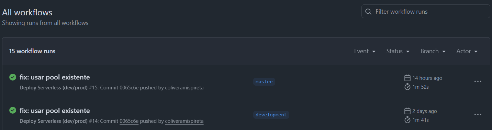
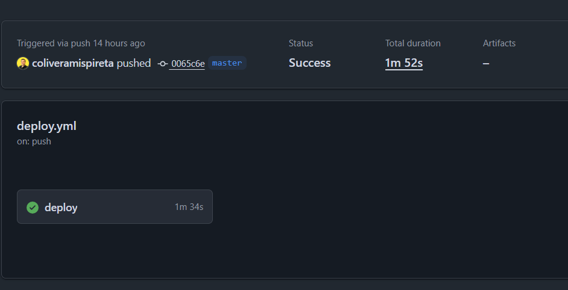
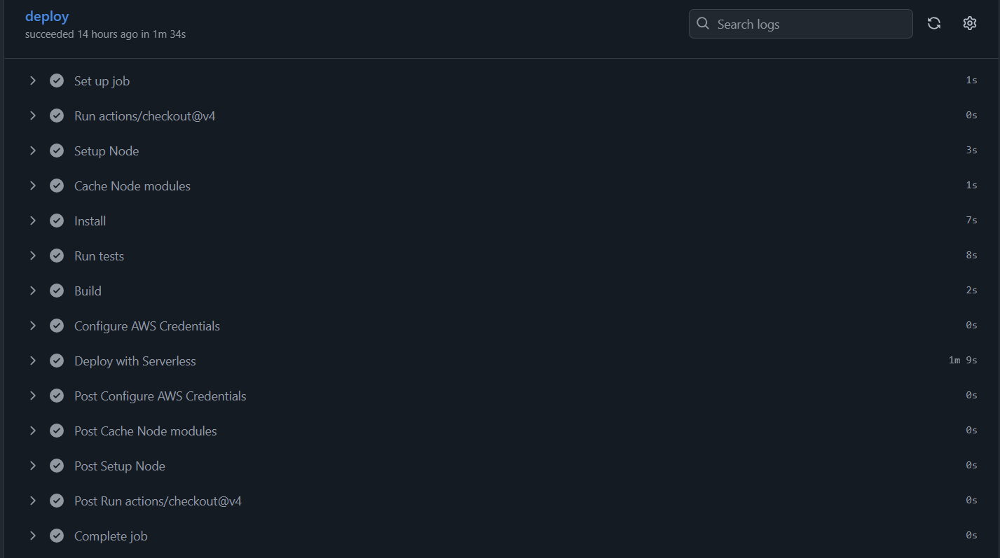
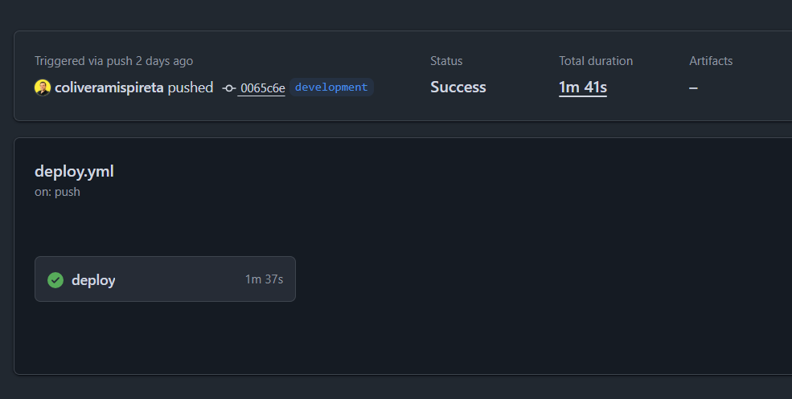
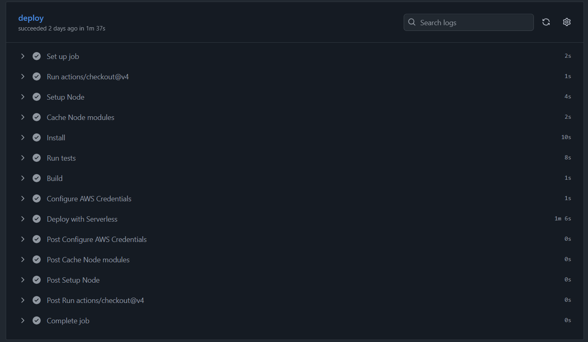
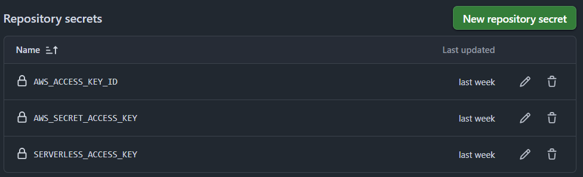

# Serverless CRUD Tickets API

## Descripción

Proyecto **Serverless CRUD API** para gestión de tickets usando **AWS Lambda, API Gateway y DynamoDB**.

- Toda la infraestructura se automatiza con **Serverless Framework**.
- No se utiliza integración directa de API Gateway con DynamoDB, todas las operaciones CRUD pasan por Lambdas.
- Soporta **multi-stage deployments** (`dev` y `prod`) vía **GitHub Actions**.

---

## Arquitectura

Client → API Gateway → Lambda → DynamoDB

- **Lambdas**: `createTicket`, `getTicket`, `listTickets`, `updateTicket`, `deleteTicket`
- **Lambda Cognito PreSignUp**: intercepta la creación de usuarios en Cognito y los confirma automáticamente.
- **Tabla DynamoDB**: `serverless-crud-guru-challenge-tickets-{stage}`
- **CI/CD**: GitHub Actions workflow para deploy automático al hacer push en ramas `development` y `master`.

---

## Pre-requisitos

- Node.js v20.x
- npm v9.x
- AWS CLI configurado con credenciales
- Git

---

## Instalación

```bash
# Clona el repositorio
git clone https://github.com/tu-usuario/serverless-crud-guru-challenge.git

# Posiciónate en la carpeta raíz
cd serverless-crud-guru-challenge

# Instala dependencias
npm ci
```

## Build

```bash
# Compila TypeScript (excluye tests)
npm run build
```

## Lint y Formateo

```bash
# Ejecuta ESLint sobre el código fuente
npm run lint

# Formatea el código con Prettier
npm run format

# Verifica tipos TypeScript sin generar archivos
npm run type-check
```

## Tests

```bash
# Ejecuta tests unitarios con Jest
npm run test
```

## Server Offline (desarrollo local)

```bash
# Levanta API Gateway y Lambdas en local para pruebas
npm run dev
```

## Deploy

```bash
# Deploy a Dev
npm run deploy:dev

# Deploy a Prod
npm run deploy:prod
```

## Remove (desplegar y eliminar stack)

```bash
# Eliminar la infraestructura de Dev
npm run remove:dev
```

---

---

# Configuración de variables y secretos

### Variables en SSM Parameter Store

Estas variables deben existir en **AWS SSM** según el stage (`dev` o `prod`):

| Variable         | Path / Descripción                   |
| ---------------- | ------------------------------------ |
| `AUTH_TOKEN`     | `/crud-guru/${sls:stage}/auth-token` |
| `USER_POOL_ID`   | `/myapp/userpool-id`                 |
| `USER_POOL_NAME` | `/myapp/userpool-name`               |

> Nota: `AUTH_TOKEN` se usa en todos los endpoints como `Authorization: Bearer AUTH_TOKEN`.

---

### Secrets en GitHub Actions

Agrega estas variables en los **Secrets** del repositorio para que CI/CD funcione correctamente:

```text
AWS_ACCESS_KEY_ID
AWS_SECRET_ACCESS_KEY
SERVERLESS_ACCESS_KEY
```

---

---

# Endpoints CRUD

## Todos los endpoints requieren el header de autorización:

> El `AUTH_TOKEN` debe configurarse en **SSM Parameter Store** según el stage:
>
> - `/crud-guru/dev/auth-token`
> - `/crud-guru/prod/auth-token`

---

| Método | Ruta          | Descripción                 | Body / Parámetros                                                                                                                                                                                                           |
| ------ | ------------- | --------------------------- | --------------------------------------------------------------------------------------------------------------------------------------------------------------------------------------------------------------------------- |
| POST   | /tickets      | Crear un nuevo ticket       | `{ "passengerName": "string", "flightNumber": "string", "origin": "string", "destination": "string", "seatNumber": "string", "price": "number", "status": "string" }`                                                       |
| GET    | /tickets      | Listar todos los tickets    | N/A                                                                                                                                                                                                                         |
| GET    | /tickets/{id} | Obtener un ticket por ID    | `id` en path                                                                                                                                                                                                                |
| PUT    | /tickets/{id} | Actualizar un ticket por ID | `id` en path + body (solo los parametros a actualizar)`{ "passengerName": "string", "flightNumber": "string", "origin": "string", "destination": "string", "seatNumber": "string", "price": "number", "status": "string" }` |
| GET    | /tickets      | Listar todos los tickets    | N/A                                                                                                                                                                                                                         |
| DELETE | /tickets/{id} | Eliminar un ticket por ID   | `id` en path                                                                                                                                                                                                                |

> Nota: Cada endpoint está conectado a **Lambda** y **DynamoDB**, no hay integración directa desde API Gateway.

---

## Ejemplos usando localhost

> Nota: Asegúrate de ejecutar `npm run dev` para levantar la API localmente en `http://localhost:3000`.
> Todos los endpoints requieren el header de autorización!
> Authorization: Bearer {AUTH_TOKEN}

### Crear ticket

```bash
curl -X POST http://localhost:3000/dev/tickets \
  -H "Content-Type: application/json" \
  -H "Authorization: Bearer {AUTH_TOKEN}" \
  -d '{ "passengerName": "JOSE", "flightNumber": "123", "origin": "LIMA", "destination": "MIAMI", "seatNumber": "12A", "price": 200.00, "status": "booked" }'
```

### Listar tickets

```bash
curl -X GET http://localhost:3000/dev/tickets \
  -H "Authorization: Bearer {AUTH_TOKEN}"
```

### Obtener ticket por ID

```bash
curl -X GET http://localhost:3000/dev/tickets/{id} \
  -H "Authorization: Bearer {AUTH_TOKEN}"
```

### Actualizar ticket

```bash
curl -X PUT http://localhost:3000/dev/tickets/{id} \
  -H "Content-Type: application/json" \
  -H "Authorization: Bearer {AUTH_TOKEN}" \
  -d '{ "passengerName": "JOSE MARTIN PEREZ CENTENO" }'
```

### Eliminar ticket

```bash
curl -X DELETE http://localhost:3000/dev/tickets/{id} \
  -H "Authorization: Bearer {AUTH_TOKEN}"
```

---

---

## Lambda Cognito PreSignUp

Esta Lambda se ejecuta como **trigger PreSignUp** en Amazon Cognito y tiene la siguiente funcionalidad:

- Intercepta la **creación de usuarios en Cognito**.
- Confirma automáticamente al usuario, evitando la necesidad de confirmación manual por correo.
- Permite que los usuarios creados por el flujo automático puedan autenticarse inmediatamente.
- Integración con **USER_POOL_ID** y **USER_POOL_NAME** definidos en **SSM Parameter Store**:

---

---

## CI/CD (GitHub Actions)

La integración continua y despliegue automático se realiza mediante **GitHub Actions**.

### Workflow

- Archivo: `.github/workflows/deploy.yml`
- Ejecuta deploy automático a AWS usando Serverless Framework cada vez que hay push a las ramas configuradas.

### Branches y multi-stage deployments

| Branch        | Stage |
| ------------- | ----- |
| `development` | Dev   |
| `master`      | Prod  |



---

## Cada push a `master` dispara un deploy al stage **prod**.




---

## Cada push a `development` dispara un deploy al stage **dev**.




---

#### Recuerda configurar los Secrets necesarios en GitHub Actions

---


